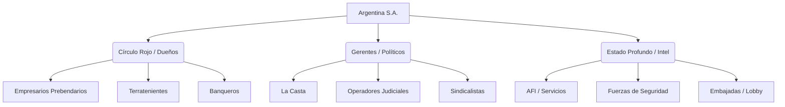

# 🇦🇷 MOC - Argentina: La Estructura De Poder

> [!INFO]
> Mapa de contenido que organiza las 100+ notas sobre el funcionamiento real del poder en Argentina, siguiendo la metodología de "Terapia Liberal" (Cui Bono / Follow the Money).

## Mapa Mental (Mermaid)

## 1. 🎩 El Círculo Rojo (Los Dueños)

_Quienes nunca se van, gobierne quien gobierne._

| Empresario | Grupo/Empresa | Sector | Tier |
| :--- | :--- | :--- | :--- |
| [[Eduardo Elsztain]] | IRSA / Banco Hipotecario | Inmobiliario / Tierras | A |
| [[Paolo Rocca]] | [[Techint]] | Acero / Energía | A |
| [[Eduardo Eurnekian]] | [[Corporacion America]] | Aeropuertos / Chips | A |
| [[Alejandro Bulgheroni]] | Pan American Energy | Petróleo | A |
| [[Héctor Magnetto]] | [[Grupo Clarin]] | Medios / Telecom | A |
| [[Jorge Brito]] | Banco Macro | Finanzas | A |
| [[Lazaro Baez]] | Austral Construcciones | Obra Pública (K) | B |
| [[Cristobal Lopez]] | Grupo Indalo | Juego / Medios | B |
| [[Jose Luis Manzano]] | Integra Capital | Energía / Medios / Litio | B/Conector |
| [[Enrique Eskenazi]] | Grupo Petersburg | Petróleo / Construcción | B |
| [[Belocopitt (Swiss Medical)]] | Swiss Medical | Salud / Medios | B |
| [[Gregorio Perez Companc]] | Molinos Río de la Plata | Alimentos | A |
| [[Hugo Sigman]] | Insud | Farmacéutica | A |
| [[Nicolas Caputo]] | Mirgor | Construcción / Electrónica | B/Conector |
| [[Marcelo Mindlin]] | Pampa Energía | Energía / Luz | A |
| [[Gustavo Grobocopatel]] | Los Grobo | Alimentos | A |
| [[Familia Werthein]] | Grupo Werthein | DirecTV / Seguros | A |
| [[Sebastian Eskenazi]] | Grupo Petersburg | YPF / Construcción | B |
| [[Laboratorios Bago]] | Bagó | Farmacéutica | A |
| [[Rubén Cherñajovsky]] | Newsan | Electrónica (Tierra del Fuego) | A |
| [[Alfredo Coto]] | Coto | Supermercados | A |
| [[Marcos Galperin]] | Mercado Libre | Tech / Finanzas | A |

## 2. 🏛️ Operadores Políticos Y "La Casta"

_Los gestores del sistema._

### Figuras Históricas Y Operadores

- [[Enrique _Coti_ Nosiglia|Enrique 'Coti' Nosiglia]] (El monje negro radical)
- [[Eduardo Duhalde]] (El padrino del conurbano)
- [[Sergio Massa]] (El ventajita / Embajada)
- [[Cristina Kirchner]] (La jefa del movimiento nacional)
- [[Mauricio Macri]] (El ingeniero del círculo rojo)
- [[Carlos Menem]] (El modernizador corrupto)
- [[Raúl Alfonsín]] (El padre de la democracia fallida)
- [[Hugo Moyano]] (El dueño del transporte)
- [[Roberto Baradel]] (El dueño de la educación)
- [[Gildo Insfran]] (El señor feudal de Formosa)
- [[Gerardo Morales]] (El virrey del litio)
- [[Elisa Carrio]] (La fiscal selectiva)
- [[Guillermo Moreno]] (El perro guardián)
- [[Anibal Fernandez]] (El todoterreno)
- [[Chiche Gelblung (Inteligencia)]] (Vínculos históricos)
- [[Enrique _Coti_ Nosiglia|Enrique "Coti" Nosiglia]] (El monje negro real)
- [[Jose Luis Manzano]] (Litio y Medios)
- [[La Coordinadora (UCR)]] (Estructura histórica)
- [[Santiago Bausili]] (Bicicleta Financiera)
- [[Fundacion Mediterranea]] (Semillero)
- [[Consejo Interamericano de Comercio y Produccion|Consejo Interamericano de Comercio y Producción (CICYP)]] (El Lobby)
- [[Martin Insaurralde]] (El símbolo de la degradación)
- [[Juan Grabois]] (El gerente de la pobreza)

### La Era Milei

- [[Javier Milei]] (El León / Presidente)
- [[Karina Milei (El Jefe)]] (El poder real)
- [[Santiago Caputo]] (El arquitecto)
- [[Victoria Villarruel]] (La agenda militar)
- [[Federico Sturzenegger]] (El desregulador)
- [[Toto Caputo]] (El financista)
- [[Sandra Pettovello]] (Capital Humano)
- [[Lilia Lemoine]] (Batalla cultural)

## 3. 🕵️ Inteligencia Y Estado Profundo

_Donde se cocinan las carpetas y el poder real._

- **Agencias:** [[00_Glosario - Conceptos Fase 1#AFI (Agencia Federal de Inteligencia)|AFI (Agencia Federal de Inteligencia)]] | [[Inteligencia Militar]] | [[Policía de la Ciudad (Espionaje)]]
- **Personajes:** [[Jaime Stiuso]] | [[Cesar Milani]] | [[Alberto Nisman]]
- **Casos/Métodos:** [[Carpeta (Extorsión)]] | [[Proyecto X (Gendarmería)]] | [[D_Alessio Gate|D'Alessio Gate]] | [[Servicio Penitenciario Federal]] (Espionaje illegal)
- **Justicia:** [[Jueces Federales de Comodoro Py]] | [[Lawfare]] | [[Causa Cuadernos]] | [[Hotesur y Los Sauces]] | [[Indultos de Menem]]

## 4. 🌍 Recursos Estratégicos Y Soberanía

_El botín que busca el mundo._

- **Energía:** [[Vaca Muerta]] | [[YPF]] | [[Energía Nuclear (INVAP)]]
- **Litio:** [[00_Glosario - Conceptos Fase 1#Litio en Jujuy (Livent)|Litio en Jujuy (Livent)]] | [[Triangulo del Litio]]
- **Territorio:** [[Hidrovia Parana]] | [[Mar Argentino (Pesca Ilegal)]] | [[Antartida Argentina]] | [[Lago Escondido (Joe Lewis)]] | [[Tierras de Benetton]] | [[Base China en Neuquen]]
- **Campo:** [[Campo y Retenciones]] | [[Resolucion 125]] | [[Sociedad Rural Argentina]]
- **Agua:** [[Acuífero Guaraní (Argentina)]] | [[Glaciares (Ley)]]

## 5. 📺 Medios, Cultura E Historia

_La fábrica de consenso._

- **Medios:** [[Grupo Clarin]] | [[La Nacion +]] | [[Pagina 12]] | [[Jorge Lanata]] | [[Horacio Verbitsky]] | [[678 y el Relato]] | [[Pauta Oficial]] | [[Futbol para Todos]]
- **Fenómenos:** [[Batalla Cultural (Argentina)]] | [[Las Fuerzas del Cielo]] | [[Pacto de Mayo]] | [[Protocolo Anti-Piquetes]]
- **Hitos Históricos:** [[Crisis de 2001]] | [[Corralito]] | [[Hiperinflacion de 1989]] | [[Pacto de Olivos]] | [[Muerte de Nestor Kirchner]] | [[Triple Crimen de General Rodriguez]] | [[Valijas de Antonini Wilson]]

---

> [!NOTE] Rastriables Dataview
> Lista completa generada automáticamente:

## 🔍 NODOS DETECTADOS (AUDITORIA 2026)

- [[DINASTIAS_FINANCIERAS]]
- [[MASTER_LIST_DINASTIAS]]
- [[Piqueteros]]
- [[Martin Insaurralde]]
- [[Cesar Milani]]
- [[Héctor Magnetto]]
- [[Union Industrial Argentina]]
- [[Maximo Kirchner]]
- [[Elite Coordinada]]
- [[AMIA]]
- [[Alianza Anticomunista Argentina]]
- [[Antartida Argentina]]
- [[Asesinato del Archiduque Franz Ferdinand]]
- [[Crisis Argentina Milei]]
- [[CELS]]
- [[Gildo Insfran]]
- [[Fundacion Huesped]]
- [[Carlitos Menem Jr]]
- [[Eleccion de Milei]]
- [[Gregorio Perez Companc]]
- [[Axel Kicillof]]
- [[Grupo Clarin]]
- [[Hector Magnetto_LEGACY]]
- [[Karina Milei]]
- [[Milei y el Sionismo]]
- [[Nicolas Caputo]]
- [[Muerte de Nestor Kirchner]]
- [[La Coordinadora]]
- [[Nestor Kirchner]]
- [[Sebastian Eskenazi]]
- [[Port Arthur Massacre]]
- [[Paracelso y la Bio-Ingenieria]]
- [[Tabula Smaragdina]]
