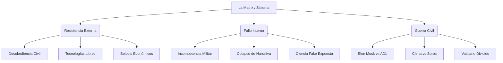

# 📉 MOC - Fricciones Y Fallos De La Matrix (Glitches)

> [!FAILURE] OBJETIVO
> Este índice documenta los casos donde la "Agenda" falló, generó resistencia masiva o colapsó por su propia incompetencia o arrogancia (Hubris). El enemigo no es invencible.

## Mapa Mental (Mermaid)

## 1. 🔥 Resistencia Popular (El Factor Humano)

- [[Protestas de Agricultores en Europa]] (Tractores vs [[Agenda 2030]])
- [[Convoy de la Libertad (Canadá)]] (Camioneros vs Trudeau)
- [[Revuelta de Sri Lanka]] (Colapso por [[ESG]])
- [[Chalecos Amarillos (Francia)]] (Rebelión fiscal)
- [[No Comply (Movimiento)]] (Resistencia a mandatos)
- [[Homeschooling (Éxodo Educativo)]]
- [[Desobediencia Fiscal]]
- [[Protestas en China (Zero COVID)]]
- [[Boicot a Target]] (Contra ideología en niños)
- [[Paro del Campo 2008 (Argentina)]]

## 2. 📉 Go Woke, Go Broke (Fallos Económicos)

- [[Boicot a Bud Light]] (Destrucción de marca líder)
- [[El Fracaso de Disney]] (Pérdidas en taquilla)
- [[Colapso de Silicon Valley Bank]] (Banca woke quebrada)
- [[El Invierno ESG]] (Retiro de capitales)
- [[Crisis de la Industria Automotriz|Crisis de la Industria Automotriz (EVs)]] (Ford/GM perdiendo dinero)
- [[Hertz vende sus Teslas]]
- [[Caida de Beyond Meat]] (Rechazo a carne falsa)
- [[Burbuja de las Energias Renovables]]
- [[Victoria_s Secret Rebranding|Victoria's Secret Rebranding]]
- [[Gillette Toxic Masculinity Ad]]

## Guerra Económica & Colapso Financiero

- [[00_Glosario - Conceptos Fase 1#The Great Taking (David Webb)|The Great Taking (David Webb)]] (Confiscación de activos)
- [[DTCC (Depository Trust & Clearing Corp)]] (Dueños reales de acciones)
- [[00_Glosario - Conceptos Fase 1#Derivados (Quadrillion Dollar Bubble)|Derivados (Quadrillion Dollar Bubble)]]
- [[Repo Market Crisis 2019]] (La pre-pandemia)
- [[Reverse Repo Facility]]
- [[Choke Point 2.0]] (Ataque a Crypto)
- [[Operation Choke Point (Original)]]
- [[SWIFT Weaponization]] (Desdolarización acelerada)
- [[CIPS & SPFS]] (Alternativas china/rusa)
- [[Gold Repatriation]] (Bancos centrales acumulando)
- [[Cantillon Effect]] (Inflación como robo)
- [[Exorbitant Privilege]] (Dólar)

## 3. 💾 Tecnocracia Fallida (Utopías Rotas)

- [[El Metaverso (El Pueblo Fantasma)]]
- [[Google Glass]] (Rechazo a vigilancia)
- [[Las Smart Cities Fantasmas de China]]
- [[El Fracaso del 'Great Reset' (Branding)]]
- [[Cierre de Amazon Go]] (IA falsa)
- [[Quiebre de FTX]] (Fraude cripto woke)
- [[Theranos (Elizabeth Holmes)]]
- [[El Auto de Apple (Proyecto Titan)]]
- [[Algoritmos Racistas (Ironía)]] ([[Google (Orígenes)]] Gemini)
- [[La Caida de los NFTs]]

## 4. ⚔️ Guerras Internas (Canibalismo De Élite)

- [[Elon Musk vs ADL]] (Batalla por censura)
- [[Texas vs BlackRock]] (Guerra financiera estatal)
- [[China vs Soros]] (Ruptura globalista)
- [[Guerra Vaticana (Francisco vs Burke)]]
- [[Project Veritas vs James O_Keefe|Project Veritas vs James O'Keefe]]
- [[La Caída de Tucker Carlson (Fox)]]
- [[Guerra de Oligarcas Rusos]] (Ventanas)
- [[Interna Demócrata (Sanders vs Clinton)]]
- [[Jeff Bezos vs National Enquirer]]
- [[La Pelea por OpenAI]] (Seguridad vs Capital)

## 5. 🤡 Incompetencia Militar Y Geopolítica

- [[Retirada de Afganistan]] (Desastre logístico)
- [[Sanciones a Rusia (Efecto Boomerang)]]
- [[Sabotaje del Nord Stream|Sabotaje al Nord Stream]] (Humillación alemana)
- [[La Mentira de las WMD en Irak]] (Fin de credibilidad [[CIA]])
- [[El Muelle de Gaza (Biden)]] (Puerto roto)
- [[El Tanque Armata (Rusia)]] (Vaporware militar)
- [[Falta de Reclutas (Crisis Militar)]]
- [[Crisis de Municiones OTAN]]
- [[El Fracaso del Cambio de Regimen en Siria]]
- [[La Humillación en el Sahel (África)]]

## 6. 🗣️ Colapso De La Narrativa (Mentiras cortas)

- [[Lab Leak Theory]] (De conspiración a verdad)
- [[La Laptop de Hunter Biden]]
- [[Russiagate (Trump-Rusia)]]
- [[Safe and Effective]] (Evolución del slogan)
- [[Jussie Smollett]] (Crimen de odio falso)
- [[Covington Kids]] (Difamación fallida)
- [[Pizzagate (Lo que se ignoró)]]
- [[El Badejo]] (Fatiga de crisis)
- [[Efecto Streisand (Censura)]]
- [[Trust in Media (Mínimos Históricos)]]

## 7. 💊 Disidencia Científica (La Rebelión De Los Batas Blancas)

- [[Great Barrington Declaration]] (Epidemiólogos contra encierros)
- [[Los Papeles de Pfizer (Liberación Judicial)]]
- [[Aseem Malhotra]] (Cardiólogo arrepentido)
- [[Robert Malone]] (Inventor ARNm)
- [[Retractacion de The Lancet]] (Fraude HCQ)
- [[Cochrane Review sobre Mascarillas]]
- [[Escándalo del Azúcar (Harvard)]]
- [[Lysenkoismo Moderno]]
- [[Crisis de replicacion]]
- [[Big Pharma Fines]]

## 8. 🛠️ Tecnologías De Libertad (La Salida)

- [[Bitcoin (Como batería de la libertad)]]
- [[Monero]] (Privacidad real)
- [[Nostr]] (Red social incensurable)
- [[Freenet]] / I2P
- [[Impresión 3D de Armas (FGC-9)]]
- [[Meshtastic]] (Radio off-grid)
- [[Semillas Open Source]]
- [[Linux y Software Libre]]
- [[Tor Network]]
- [[Sci-Hub]] (Ciencia libre)

## 9. 🏛️ Precedentes Históricos (Nada Es eterno)

- [[Caida de la URSS]] (Colapso interno)
- [[La Republica de Weimar]] (Hiperinflación)
- [[Caida de Roma]]
- [[Revolucion Francesa]]
- [[Ceausescu en Rumania]]
- [[La Torre de Babel]]
- [[Colapso de la Edad de Bronce]]
- [[Maria Antonieta]] (Desconexión)
- [[Watergate]]
- [[La Peste Negra (Efecto Social)]]

## 10. 🇦🇷 Fricciones Argentinas (Laboratorio)

- [[La 125 (Derrota K)]]
- [[Renuncia de Guzman]]
- [[La Fiesta de Olivos]]
- [[El Vacunatorio VIP]]
- [[Insaurralde en el Yate]]
- [[La Mesa del Hambre]]
- [[El Censo 2010 (Manipulado)]]
- [[Vicentin (Intento de expropiación fallido)]]
- [[El Fallo de la Corte por la Coparticipacion]]
- [[El Atentado a CFK (La incredulidad social)]]

---

> [!NOTE] Rastriables Dataview
> Lista completa generada automáticamente:
