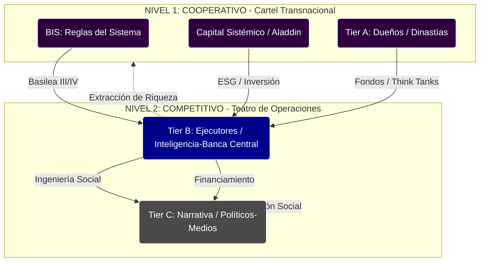

# 🗺️ Mapa De Poder Global: La Matriz GOLD (v4.0)

Este documento es el índice estructural de la **Bóveda de Terapia Liberal**. Mapea los incentivos de la oligarquía transnacional mediante la **Matriz de Dos Niveles**.

## 🏗️ LA MATRIZ DE DOS NIVELES

### NIVEL 1: JUEGO COOPERATIVO (Cartel Tier A)
*Por encima de las naciones. Aquí no hay enemigos, solo socios en la extracción de rentas.*

*   **[[BIS (Banco de Pagos Internacionales)]]:** El nodo soberano. Define las reglas del dinero.
*   **Gestores de Activos:** [[BlackRock]], [[Vanguard Group]]. Consolidan el capital sistémico y eliminan la competencia (Propiedad Común).
*   **Dinastías:** [[Familia Rothschild]], [[Familia Rockefeller]]. Capital histórico y fundadores de la infraestructura de control.

### NIVEL 2: JUEGO COMPETITIVO (Teatro Estatal)
*El tablero visible de naciones, guerras y política.*

#### ♟️ Tier B: Los Ejecutores
*Aparatos técnicos que materializan las órdenes del Nivel 1.*
*   **Inteligencia:** [[CIA]], [[Mossad]], [[MI6]]. Gestión de activos, cambio de régimen y chantaje.
*   **Banca Central:** [[Reserva Federal]], [[BCE]]. Ejecución de la inflación y control de liquidez.
*   **Think Tanks:** [[WEF]], [[CFR]], [[Chatham House]]. Reclutamiento de élites y diseño de narrativas (Great Reset).

#### 🎪 Tier C: La Narrativa
*La distracción diseñada para capturar la atención de la población.*
*   **Política:** Actores de reparto intercambiables ([[Javier Milei]], [[Donald Trump]], [[Lula da Silva]]).
*   **Medios:** [[Operación Mockingbird]] modernizada. Fragmentación del discurso y "Guerra Cultural".

## 📊 VISUALIZACIÓN ESTRUCTURAL (v4.0 GOLD)

## 📑 SECCIONES CRÍTICAS (A-Z)

### 1. Nodos De Finanzas & Control
*   **[[Reserva Federal]]**: El motor de la deuda.
*   **[[CBDC]]** / [[CBDC Interoperability]]: El mecanismo final de "dinero programado" (v12_1).
*   **[[BlackRock BUIDL]]**: Tokenización de la liquidez institucional.
*   **[[Proyecto Agorá]]** / [[Proyecto mBridge]]: Los nuevos rieles del BIS.
*   **[[ESG]]** / [[Social Credit West]]: El score social corporativo y su implementación occidental.

### 2. Nodos De Ejecución & Inteligencia
*   **[[Anduril Industries]]** / [[Shield AI]]: La guerra autónoma privatizada.
*   **[[Palantir]]** / [[Alex Karp]]: El cerebro del procesamiento de datos estatal.
*   **[[CFR]]** / [[Bilderberg 2026]]: Coordinación de la élite atlantista.
*   **[[Heritage Foundation]]** / [[JD Vance]]: La infraestructura de la "New Right".
*   **[[Jeffrey Epstein]]**: Operación de chantaje y kompromat.

### 3. Nodos De Bioseguridad & Bio-Control
*   **[[Tratado de Pandemias OMS]]**: La cesión de soberanía sanitaria.
*   **[[Moderna]]** / [[Pfizer]]: El complejo industrial farmacéutico-militar.
*   **[[Bio-Digital Convergence]]**: La integración hombre-máquina.
*   **[[Lab-Grown Meat]]** / [[Programmable Food]]: La captura alimentaria.

### 4. Nodos De Narrativa & Guerra Cognitiva
*   **[[Cognitive Warfare]]**: El sexto dominio de la guerra (la mente).
*   **[[Manufacture of Consent 2.0]]**: Ingeniería del consentimiento algorítmica.
*   **[[Dead Internet Theory]]**: La automatización total de la infosfera.
*   **[[Disinformation Governance Board]]**: El Ministerio de la Verdad digital.
*   **[[Reality Privilege]]**: El acceso a lo físico como lujo de clase.

## 📑 ÍNDICE DE EXPANSIÓN 2026 (A-Z)

A continuación, la lista completa de las 50 entidades incorporadas en la auditoría v12_1:

| A-C | D-G | H-L | M-P | R-Z |
| :--- | :--- | :--- | :--- | :--- |
| [[Alex Karp]] | [[Dead Internet Theory]] | [[Heritage Foundation]] | [[Manufacture of Consent 2.0]] | [[Reality Privilege]] |
| [[Algorithmic Governance]] | [[Digital Yuan Expansion]] | [[JD Vance]] | [[Meta Llama 4]] | [[RWA Protocol]] |
| [[Amazon Trainium 2]] | [[Disinformation Governance Board]] | [[Lab-Grown Meat]] | [[Microsoft Fairwater]] | [[Shield AI]] |
| [[Anduril Industries]] | [[DOD 2026 Strategy]] | [[Le Cercle]] | [[Moderna]] | [[Social Credit West]] |
| [[Atlantic Council]] | [[GAVI]] | | [[Nudge Theory]] | [[Synthetic Biology]] |
| [[Bio-Digital Convergence]] | [[Genetic Tagging]] | | [[Ondo Finance]] | [[Tether USDS]] |
| [[BlackRock BUIDL]] | [[Groq]] | | [[OpenAI Operator]] | [[Tokenized Sovereign Debt]] |
| [[CBDC Interoperability]] | [[Grupo Bilderberg]] | | [[Palmer Luckey]] | [[Tratado de Pandemias OMS]] |
| [[CFR]] | | | [[Pfizer]] | [[Trilateral Commission]] |
| [[Chainalysis]] | | | [[Precision Medicine]] | [[Urbit 2026]] |
| [[Chatham House]] | | | [[Predictive Programming]] | [[WEF 2026]] |
| [[Cognitive Warfare]] | | | [[Programmable Food]] | [[Young Global Leaders]] |
| | | | [[Proyecto Agorá]] | |
| | | | [[Proyecto mBridge]] | |

## 🔴 SENTENCIA DE INTELIGENCIA
El mapa de poder no es un organigrama, es un **Diagrama de Incentivos**. Quita el dinero y el control del flujo de información, y la Matrix colapsa. El Nivel 1 coopera para que el Nivel 2 pueda seguir compitiendo (o fingiendo que lo hace).

---
**Versión:** 4.0 GOLD
**Estado:** Mapa Maestro Actualizado

