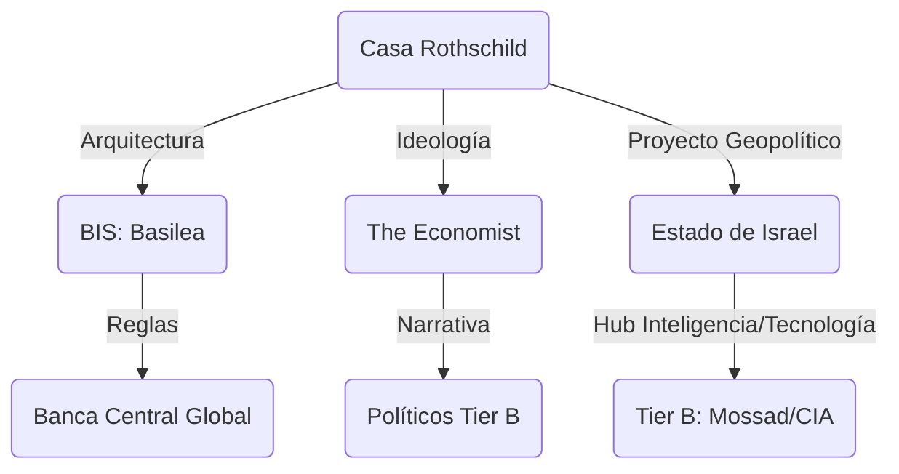

# Familia Rothschild: El Patrón Del Nivel 1

> [!ABSTRACT] Hipótesis Informativa
> Nodo fundacional del **Nivel 1 (Cooperativo)**. Los Rothschild no son "banqueros" en el sentido moderno, sino los arquitectos de la infraestructura financiera basada en la deuda soberana. Su función real es la custodia de agendas transnacionales de largo plazo y el blindaje del capital dinástico frente a los ciclos políticos del Nivel 2. Su mayor éxito operativo es haber pasado de ser "los dueños visibles" a ser el "tejido conectivo invisible" del cartel global.

## Análisis De Tiers

### Tier A: Dueños Y Arquitectos (Nivel 1)

- **Ingeniería de Israel:** Proyecto geopolítico central para asegurar un nodo de control en el Levante. Desde la [[Declaración Balfour]] hasta la financiación de la Knesset, Israel funciona como el activo estratégico innegociable de la dinastía.
- **Red de Custodia:** Operan mediante una estructura de fideicomisos y banca privada (Ginebra/Londres) que permite la "invisibilización" del capital. No necesitan estar en el S\&P 500 bajo su nombre; operan a través de la red de gestores como [[BlackRock]].

### Tier B: Los Ejecutores (Nivel 2)

- **Rothschild & Co:** Actúan como los "maestros de ceremonias" de la consolidación corporativa a nivel global, asesorando las fusiones que crean los monopolios del Tier A.
- **Control de Narrativa:** A través de **The Economist**, definen el marco de pensamiento económico (Net Zero, Austeridad, Globalismo) que los políticos de Tier B deben obedecer para ser validados por el sistema.

### Tier C: El Teatro De La Filantropía

- **Fachada Aristocrática:** Uso del coleccionismo, el vino y la filantropía para proyectar una imagen de "viejo dinero" inofensivo, alejando el escrutinio de sus operaciones de inteligencia y financieras.

## Mecanismos De Poder (Dinámica Dinástica)

1. **Inversión de Red:** Conexión con cada nodo crítico de Tier A; actúan como el pegamento que mantiene la cooperación en el Nivel 1.
2. \*\* Follow the Gold:\*\* Aunque el oro ya no es la moneda oficial, los Rothschild mantienen el control de la infraestructura de trading (London Gold Fix) y los flujos físicos.

## Conexiones Críticas

- [[Israel]]: Su creación física y financiera.
- [[Familia Rockefeller]]: Socios de convergencia en el siglo XXI (RIT Capital Partners).
- [[BIS]]: Inspirado en su modelo de banca central privada e inmune.

## Conclusión Del Análisis

Los Rothschild son el ejemplo perfecto de que el verdadero poder no grita, susurra. Son el Tier A original que entendió que es mejor ser el dueño de la cañería que el agua que pasa por ella. 🔴

---

**Versión:** 4.0 GOLD
**Enfoque:** Custodia Dinástica
**Estado:** Informe de Inteligencia Activo
