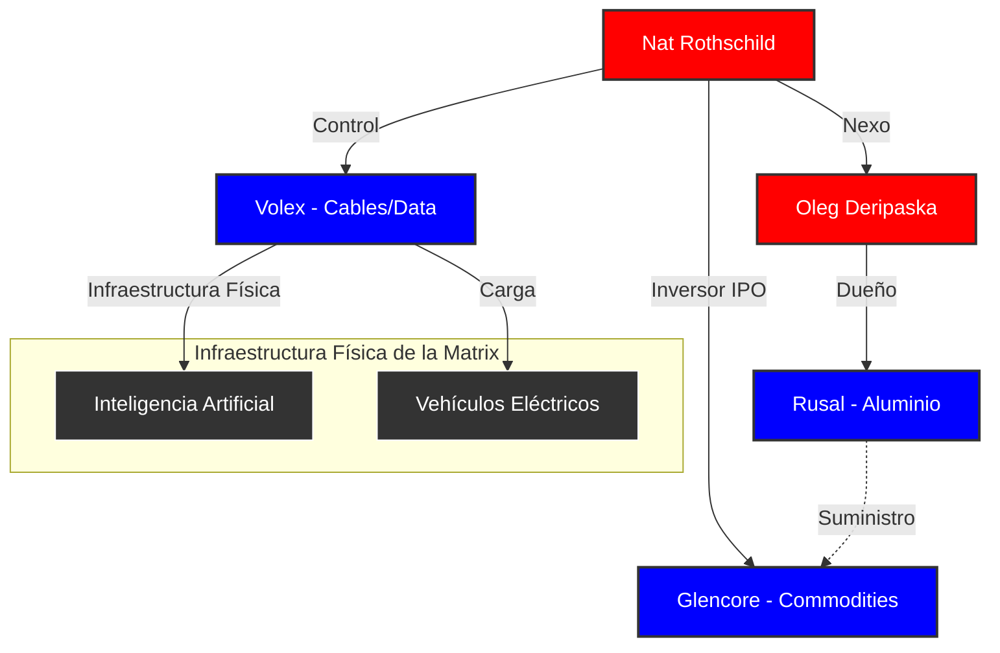

# Nathaniel Rothschild: El Soberano De Los Recursos (v1.0)

> [!ABSTRACT] Hipótesis Informativa
> Nathaniel "Nat" Rothschild representa la evolución del **Tier A** hacia el control físico de la Matrix. Mientras su padre ([[Jacob Rothschild]]) gestionaba la diplomacia financiera, Nat se ha posicionado como el **dueño de los átomos**. Su función operativa es capturar los cuellos de botella de la economía real: materias primas críticas (aluminio, cobre, carbón) e infraestructura de conectividad física (cables de datos y energía), asegurando que la "Transición Verde" y la IA sigan siendo tributarias de la dinastía.

## Análisis De Tiers

### Tier A: El Control De Los Átomos Y La Energía

- **El Eje de los Commodities (Glencore/Rusal):** Nat ha sido el puente crítico entre el capital dinástico y los recursos estratégicos de Eurasia. Su inversión en **Glencore** y su sociedad con **[[Oleg Deripaska]]** demuestran que el Tier A no reconoce fronteras ni sanciones; su objetivo es el monopolio del aluminio y los metales necesarios para la industria militar y tecnológica global.
- **La Herencia del Título (2024):** Al asumir como 5th Baron, hereda no solo el linaje, sino el rol de "Liquidador" de activos. Su agresividad financiera (visto en su reciente litigio contra Tennor International) marca el fin de la era del "acuerdo de caballeros" de su padre, pasando a un modelo de captura de activos bajo estrés.

### Tier B: Los Nervios De La Infraestructura

- **Volex y la Ruta de la Seda Digital:** Como presidente de **Volex**, Nat controla los "nervios" de la IA y los vehículos eléctricos. Volex no es una empresa de cables; es el proveedor de infraestructura crítica para centros de datos y estaciones de carga. Al comprar empresas en Turquía y Asia, está mapeando físicamente los flujos de energía y datos del futuro.
- **Redes de Inteligencia Económica:** Utiliza vehículos como JNR Limited para realizar operaciones de prospección y captura de recursos en mercados emergentes, operando a menudo en las sombras de la diplomacia oficial británica.

### Tier C: La Población De La Escasez

- **El Peaje de la "Sostenibilidad":** Para el Tier C, la Agenda 2030 se vende como "salvar el planeta". Para Nat Rothschild, es un plan de negocios donde él es el dueño de los materiales necesarios para fabricar cada batería y cada cable de esa "nueva economía". El Tier C paga el "Impuesto Verde" mientras la riqueza se transfiere a los dueños de los recursos que Nat controla.

## Mecanismos De Poder

1. **Monopolio de Suministros Críticos**: Posicionamiento en empresas que controlan el suministro global de metales sin los cuales la tecnología moderna (chips, baterías) no puede existir.
2. **Arbitraje Geopolítico**: La capacidad de operar con oligarcas rusos y élites occidentales simultáneamente, extrayendo renta de ambos bando sin importar los conflictos de Tier C (guerras).
3. **Control de la Conectividad Física**: El giro hacia la manufactura de hardware crítico (Volex) para asegurar que el Tier A tenga el "interruptor" físico de la red global.

## Conexiones Críticas

- [[Familia Rothschild]]: El linaje que respalda su despliegue operativo.
- [[Oleg Deripaska]]: Socio clave en el control del aluminio global y puente con el Kremlin.
- [[Glencore]]: El vehículo de Tier A para el trading de recursos mundiales.
- [[Volex]]: Su brazo industrial y tecnológico de control de infraestructura.
- [[RIT Capital Partners]]: La reserva de valor familiar que ahora busca "eficiencia" bajo su presión.

## Conclusión Del Análisis

Nathaniel Rothschild es el **"Ingeniero de la Escasez"**. Ha comprendido que en un mundo de inflación monetaria, el verdadero poder es el control de lo que no se puede imprimir. Su transición de "playboy financiero" a "soberano de recursos" marca la estrategia de la dinastía para el siglo XXI: ser los dueños de la infraestructura física sobre la cual se montará la tiranía digital y energética. Si querés saber quién ganará con la Agenda Climática, no mires a los políticos; mirá los depósitos de cobre de Nat.

## Mapa De Influencia (Visual)

