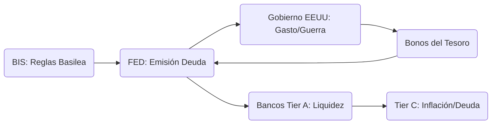

# Reserva Federal: El Motor De La Deuda (Nivel 2 / Tier B)

> [!ABSTRACT] Hipótesis Informativa
> Nodo ejecutor crítico del **Nivel 2 (Competitivo)**, aunque su propiedad reside en el cartel del **Nivel 1**. La FED no es una agencia estatal, sino un consorcio de bancos privados encargado de la emisión del dólar como instrumento de deuda perpetua. Su función real es la transferencia sistemática de riqueza de la población (Tier C) hacia el capital financiero (Tier A) mediante la inflación y la manipulación de ciclos económicos.

## Análisis De Tiers

### Tier A: Los Dueños (Nivel 1)
* **Bancos Miembros:** Las acciones de la FED de Nueva York (el nodo real de poder) están en manos de dinastías bancarias y corporaciones sistémicas. Este Tier A captura la renta mediante dividendos garantizados y el control del flujo del crédito global.
* **Coordinación Transnacional:** La FED opera bajo los estándares técnicos definidos por el **[[BIS (Banco de Pagos Internacionales)]]**, asegurando que el dólar sirva como arquitectura del sistema de control global.

### Tier B: Los Ejecutores (Nivel 2)
* **Gestión de la Ilusión:** Funcionarios como Jerome Powell ejecutan políticas de *Quantitative Easing* o subida de tasas para "ajustar" el tablero económico según las necesidades de liquidez del Tier A.
* **Captura Regulatoria:** La FED actúa como el guardián de los bancos "Too Big to Fail", socializando sus pérdidas y privatizando sus ganancias.

### Tier C: La Narrativa De Estabilidad
* **Historia Oficial:** "Mandato dual de pleno empleo y estabilidad de precios".
* **Realidad Signal:** Desde 1913, el dólar ha perdido el 96% de su valor adquisitivo; el verdadero mandato es la devaluación controlada para pagar deuda con dinero depreciado.

## Mecanismos De Poder (Dinámica De Flujo)

1. **Monopolio de Emisión:** El gobierno pide prestado su propio dinero con interés, garantizando que la deuda sea impagable.
2. **Inflación como Impuesto:** Transferencia de poder adquisitivo del ahorro (Tier C) hacia el primer receptor del dinero nuevo (Tier A) - **[[Efecto Cantillon]]**.

## Conexiones Críticas
- [[Jekyll Island]]: El origen del acuerdo secreto.
- [[BlackRock]]: El brazo ejecutor que ahora compra activos para la FED en las crisis.
- [[CBDC]]: El reemplazo digital para el control total sin efectivo.

## Conclusión Del Análisis
Quien controla el dinero, controla la ley. La FED es el arma más potente del cartel transnacional para someter a los Estados y a la población mediante la matemática de la deuda. 🔴

---
**Versión:** 4.0 GOLD
**Enfoque:** Extracción de Rentas
**Estado:** Informe de Inteligencia Activo

