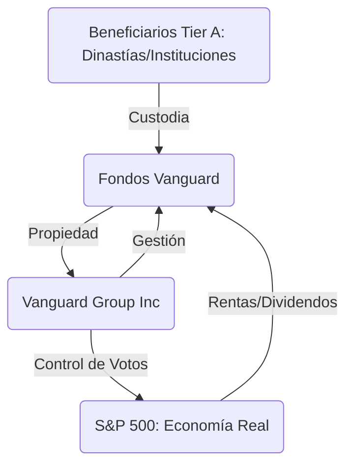

# Vanguard Group: La Materia Oscura (Nivel 1 / Tier A)

> [!ABSTRACT] Hipótesis Informativa
> Nodo de propiedad central del **Nivel 1 (Cooperativo)**. Vanguard funciona como el depósito de blindaje para el capital dinástico (Old Money) que requiere anonimato total. Su estructura de propiedad circular y su dominio sobre el S\&P 500 junto a BlackRock la posicionan como la fuerza gravitacional que anula la competencia real en el mercado global, materializando un monopolio horizontal invisible.

## Análisis De Tiers

### Tier A: Los Dueños Reales (Nivel 1)

- **Propiedad Circular:** A diferencia de otras firmas, Vanguard es propiedad de sus propios fondos. Este diseño protege a los beneficiarios finales de cualquier escrutinio público o legal, permitiendo que las familias del Tier A controlen la infraestructura corporativa global sin aparecer en los registros de la SEC nominativamente.
- **Consolidación del Cartel:** Vanguard es el accionista mayoritario de sus propios "competidores" (incluyendo BlackRock). Esta red de propiedad cruzada asegura que el Nivel 1 siempre opere como un bloque monolítico.

### Tier B: Los Ejecutores Pasivos (Nivel 2)

- **Voto en Bloque:** Utilizan el capital de los ahorristas (Tier C) para ejercer derechos de voto que imponen cambios estructurales en las empresas (DEI, Net Zero). Su "pasividad" en la inversión se convierte en "agresividad" en la gobernanza.
- **Anulación de Mercado:** Al poseer a todos los actores de un sector (ej. todas las aerolíneas), eliminan la necesidad de competir, maximizando las rentas de extracción para el Nivel 1.

### Tier C: El Rostro Del "Pequeño Inversor"

- **Bogleheads:** La narrativa de "bajos costos para el ciudadano común" es la cobertura perfecta para ocultar la concentración de poder más masiva de la historia financiera.

## Mecanismos De Poder (Propiedad Circular)

1. **Monopolio Horizontal:** Son dueños de Coca-Cola y de Pepsi. La competencia es teatro para el Tier C.
2. **Invisibilidad Operativa:** No tienen que ir a Davos ni dar entrevistas; BlackRock actúa como el escudo político mientras Vanguard mantiene la propiedad pura.

## Conexiones Críticas

- [[BlackRock]]: Socio simbiótico y copropietario de la Matrix.
- [[State Street]]: El tercer pilar del duopolio gestor.
- [[Big Pharma]]: Controladores de la fabricación y distribución sanitaria.

## Conclusión Del Análisis

Vanguard es el agujero negro del capital: no emite luz, pero todo gira a su alrededor. Es el instrumento definitivo del Tier A para asegurar que, pase lo que pase en el Nivel 2 (política/guerras), la propiedad de los medios de producción permanezca en las mismas manos. 🔴

---

**Versión:** 4.0 GOLD
**Enfoque:** Propiedad Estructural
**Estado:** Informe de Inteligencia Activo
