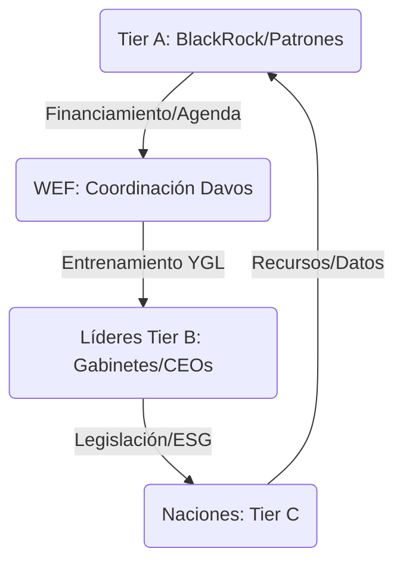

# WEF: El Centro De Reclutamiento (Nivel 2 / Tier B)

> [!ABSTRACT] Hipótesis Informativa
> Nodo de coordinación y reclutamiento crítico del **Nivel 2 (Competitivo)**. El Foro Económico Mundial actúa como la interfaz de relaciones públicas del Tier A (Nivel 1), encargada de alinear a los ejecutores estatales (Tier B) y corporativos (Tier C) con las agendas de control transnacional. Su función real es la "Penetración de Gabinetes" para asegurar que la soberanía nacional sea reemplazada por una gobernanza tecnocrática privada.

## Análisis De Tiers

### Tier A: Los Patrocinadores (Nivel 1)
* **Socios Estratégicos:** El WEF no se financia solo; sus dueños son los gigantes del Nivel 1 ([[BlackRock]], [[Vanguard]], grandes farmacéuticas y tecnológicas). Estos actores usan Davos para dictar la hoja de ruta ideológica (ESG, Great Reset) que maximiza sus rentas.
* **Ideología Malthusiana:** El WEF hereda la visión del [[Club de Roma]], promoviendo la gestión centralizada de la escasez bajo la excusa del clima.

### Tier B: Los Ejecutores (Nivel 2)
* **Young Global Leaders (YGL):** El programa de ingeniería de carrera más exitoso del mundo. Reclutan prospectos en el Tier C (políticos jóvenes) y los elevan al Tier B para que ejecuten las agendas del Nivel 1 en sus respectivos países ([[Justin Trudeau]], [[Emmanuel Macron]]).
* **Tecnocracia Corporativa:** Davos es el nodo donde se redactan los tratados y regulaciones que luego los parlamentos nacionales simplemente ratifican.

### Tier C: La Narrativa Del "Bien Común"
* **The Great Reset:** La marca comercial para la transferencia definitiva de la propiedad privada de la población hacia los gestores de activos del Tier A ("No tendrás nada y serás feliz").
* **Mesa de Diálogo:** Se presentan como una "ONG" preocupada por el mundo, ocultando su naturaleza de cartel corporativo.

## Mecanismos De Poder (Penetración)

1. **Captura de Élite:** Infiltración ideológica mediante formación y prestigio social.
2. **Propaganda Prospectiva:** Uso de simulacros ([[Event 201]]) para normalizar respuestas autoritarias ante crisis futuras.

## Conexiones Críticas
- [[Klaus Schwab]]: El rostro público de la tecnocracia.
- [[Great Reset]]: El manual de operaciones de GOLD.
- [[Agenda 2030]]: El cronograma de metas de Tier A.

## Conclusión Del Análisis
El WEF es el departamento de Recursos Humanos de la oligarquía transnacional. Su éxito no reside en la fuerza, sino en la capacidad de convencer a los políticos de que el futuro de la humanidad es ser administrados por algoritmos y gestores de activos. 🔴

---
**Versión:** 4.0 GOLD
**Enfoque:** Captura Ideológica
**Estado:** Informe de Inteligencia Activo

